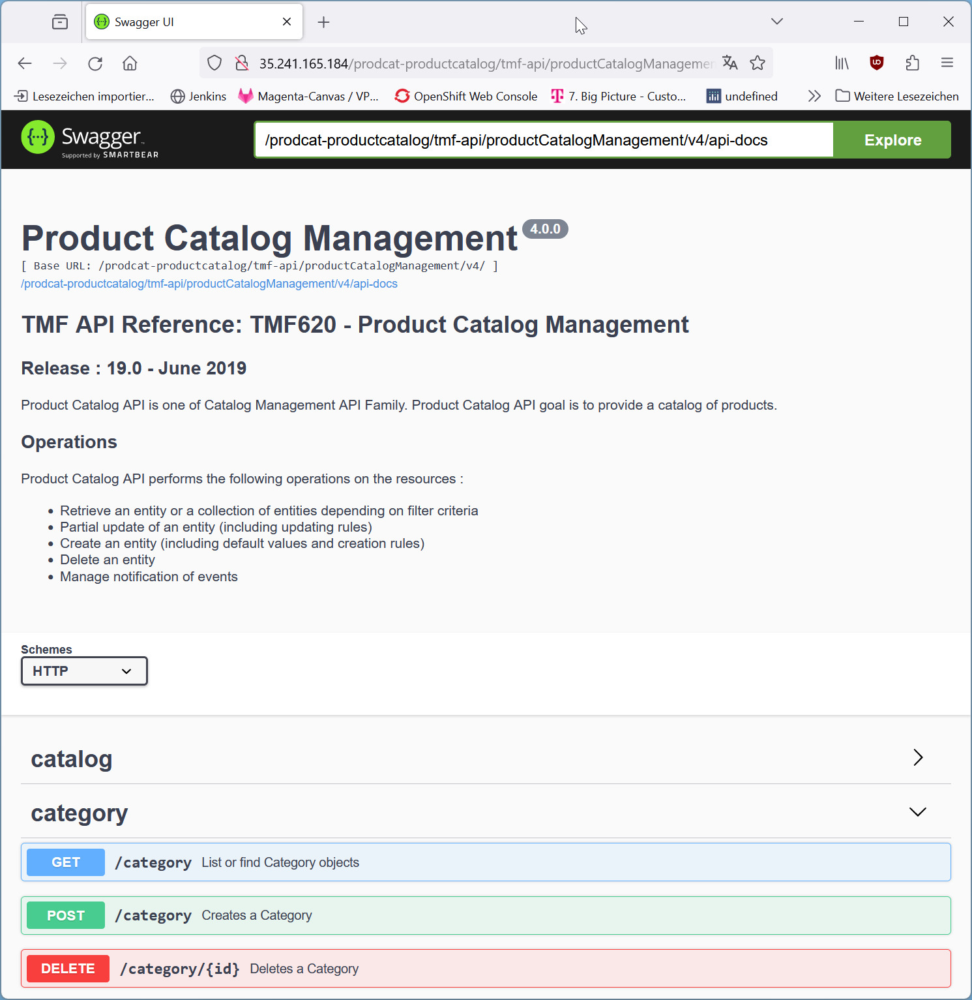

# GCP ODA Canvas

## git submodule

clone oda-canvas into subfolder oda-canvas:

```
git submodule add https://github.com/tmforum-oda/oda-canvas.git
git submodule add https://github.com/coder/code-server
```

if this repository was checked out without "--recursive", the submodules have to be loaded with the following command:

```
git submodule update --init
```

# manually create GKE cluster

https://console.cloud.google.com/kubernetes/list/overview?project=tmforum-oda-component-cluster

In clusters menu click on "[+] create" button

select "Standard: You manage your cluster "

enter cluster name "ihc-fhechler"

select "zonal" europe-west1-b  --> europe-west4-a run out of IP address quota

Select "static" control plane version "1.25.16-gke-1041000"

In Menu "default-pool"

* [x] enable cluster autoscaler
* min: 0
* max: 6

In Menu "default-pool">"Nodes":

* Boot-Disk-Type "Standard persistent disk"

## Setup gcloud

### set internet proxy (if neccessary)

```
set HTTP_PROXY=http://sia-lb.telekom.de:8080
set HTTPS_PROXY=http://sia-lb.telekom.de:8080
set NO_PROXY=10.0.0.0/8,.eks.amazonaws.com,.telekom.de

#gcloud config set proxy/type http
#gcloud config set proxy/address 1.234.56.78
#gcloud config set proxy/port 8080

```

### login to gcloud

```
gcloud auth login
```

### set default values

```
set PROJECT_ID=tmforum-oda-component-cluster
set REGION=europe-west1
set ZONE=europe-west1-a
gcloud config set project %PROJECT_ID%
gcloud config set compute/region %REGION%
gcloud config set compute/zone %ZONE%
```

### connect kubectl to cluster

```
set CLUSTER_NAME=cluster-1
gcloud container clusters get-credentials %CLUSTER_NAME% 
```

# follow the installation instructions

As described in [issue-21](https://github.com/tmforum-oda/oda-canvas/issues/121) we follow the installation instructions here:
https://github.com/tmforum-oda/oda-canvas/tree/master/installation 

## check permissions

```
kubectl auth can-i create namespaces --all-namespaces
  yes

kubectl auth can-i create customresourcedefinitions --all-namespaces
  yes

kubectl auth can-i create clusterroles --all-namespaces
  yes

kubectl auth can-i create clusterrolebindings --all-namespaces
  yes

kubectl auth can-i create mutatingwebhookconfigurations --all-namespaces
  yes

kubectl auth can-i create validatingwebhookconfigurations --all-namespaces
  yes

kubectl auth can-i create clusterissuers  --all-namespaces
  Warning: the server doesn't have a resource type 'clusterissuers'
  yes

kubectl auth can-i create serviceaccounts
  yes

kubectl auth can-i create secrets
  yes

kubectl auth can-i create configmaps
  yes

kubectl auth can-i create roles
  yes

kubectl auth can-i create rolebindings
  yes

kubectl auth can-i create services
  yes

kubectl auth can-i create deployments
  yes

kubectl auth can-i create statefulsets
  yes

kubectl auth can-i create gateways
  Warning: the server doesn't have a resource type 'gateways'
  yes

kubectl auth can-i create jobs
  yes

kubectl auth can-i create certificates
  Warning: the server doesn't have a resource type 'certificates'
  yes
  
kubectl auth can-i create issuers
  Warning: the server doesn't have a resource type 'issuers'
  yes

```

## add helm repositories

```
helm repo add jetstack https://charts.jetstack.io
helm repo add bitnami https://charts.bitnami.com/bitnami
```

## install istio

```
helm repo add istio https://istio-release.storage.googleapis.com/charts
helm repo update
kubectl create namespace istio-system
helm upgrade --install istio-base istio/base -n istio-system
helm upgrade --install istiod istio/istiod -n istio-system --wait
kubectl create namespace istio-ingress
kubectl label namespace istio-ingress istio-injection=enabled
helm upgrade --install istio-ingress istio/gateway -n istio-ingress --set labels.app=istio-ingress --set labels.istio=ingressgateway --wait
```

## install oda-canvas


### clone oda-canvas

```
git clone https://github.com/tmforum-oda/oda-canvas.git
cd oda-canvas
```

### update helm dependencies

```
cd installation\cert-manager-init
helm dependency update
cd ../canvas-oda
helm dependency update
```

### install canvas

Configure KeyCloak not to use an external IP (avoid public IP quota issues)

```
#helm upgrade --install canvas -n canvas --create-namespace .
helm upgrade --install canvas -n canvas --create-namespace --set keycloak.service.type=ClusterIP .
```

### check canvas version

```
kubectl get crd components.oda.tmforum.org -o jsonpath='{.spec.versions[?(@.served==true)].name}'
  'v1alpha3 v1alpha4 v1beta1 v1beta2 v1beta3'
```


# Deploy component


## see logs of component webhook

for debugging it might be interesting to follow the log of the component webhook in a second terminal

```
kubectl logs -n canvas deployment/compcrdwebhook -f
```

## Deploy ODA Component 

As an example the Product-Catalog ODA Component from testData is deployed

```
helm upgrade --install prodcat -n components oda-canvas/compliance-test-kit/BDD-and-TDD/testData/productcatalog-v1beta2
```

### analyze component state

directly after deployment the DEPLOYMENT_STATUS is "In-Progress-CompCon"

```
kubectl get components -A
	NAMESPACE    NAME                     DEPLOYMENT_STATUS
	components   prodcat-productcatalog   In-Progress-CompCon
```

The three APIs are not ready

```
kubectl get API -A
	NAMESPACE    NAME                                              API_ENDPOINT                                                                       IMPLEMENTATION_READY
	components   prodcat-productcatalog-metrics                    http://35.241.165.184/prodcat-productcatalog/metrics
	components   prodcat-productcatalog-partyrole                  http://35.241.165.184/prodcat-productcatalog/tmf-api/partyRoleManagement/v4
	components   prodcat-productcatalog-productcatalogmanagement   http://35.241.165.184/prodcat-productcatalog/tmf-api/productCatalogManagement/v4
```
	
After some time the APIs get ready:

```
kubectl get API -A
	NAMESPACE    NAME                                              API_ENDPOINT                                                                       IMPLEMENTATION_READY
	components   prodcat-productcatalog-metrics                    http://35.241.165.184/prodcat-productcatalog/metrics                               true
	components   prodcat-productcatalog-partyrole                  http://35.241.165.184/prodcat-productcatalog/tmf-api/partyRoleManagement/v4        true
	components   prodcat-productcatalog-productcatalogmanagement   http://35.241.165.184/prodcat-productcatalog/tmf-api/productCatalogManagement/v4   true
```

The component goes into "In-Progress-SecCon":

```
kubectl get components -A
	NAMESPACE    NAME                     DEPLOYMENT_STATUS
	components   prodcat-productcatalog   In-Progress-SecCon
```

And a few seconds later into "Complete":

```
kubectl get components -A
	NAMESPACE    NAME                     DEPLOYMENT_STATUS
	components   prodcat-productcatalog   Complete
```


## check URL

The developer-UI of the Product-Catalog-API is accessible in the internet:

http://35.241.165.184/prodcat-productcatalog/tmf-api/productCatalogManagement/v4/docs/




# install code-server

```
ß4-install-code-server.cmd
kubectl port-forward -n code-server svc/code-server 8080:8080
```
in Browser open http://localhost:8080


```
sudo apt update

## see https://computingforgeeks.com/how-to-install-node-js-on-ubuntu-debian/
#curl -sL https://deb.nodesource.com/setup_16.x | sudo bash -
#sudo apt-get install -y nodejs

# install node js v21, see https://joshtronic.com/2023/11/12/how-to-install-node-js-21-on-ubuntu/
sudo apt install -y ca-certificates curl gnupg
sudo mkdir -p /etc/apt/keyrings
curl -fsSL https://deb.nodesource.com/gpgkey/nodesource-repo.gpg.key | sudo gpg --dearmor -o /etc/apt/keyrings/nodesource.gpg
echo "deb [signed-by=/etc/apt/keyrings/nodesource.gpg] https://deb.nodesource.com/node_21.x nodistro main" | sudo tee /etc/apt/sources.list.d/nodesource.list
sudo apt update
sudo apt install nodejs -y

node -v
npm -v

#npm install mocha
#npm install @kubernetes/client-node
#npm install chai
#cd oda-canvas/compliance-test-kit/
#npm test

npm install cucumber
git clone https://github.com/tmforum-oda/oda-canvas.git
cd oda-canvas/compliance-test-kit/BDD-and-TDD

cd identity-manager-utils-keycloak
npm install
cd ../package-manager-utils-helm
npm install
cd ../resource-inventory-utils-kubernetes
npm install
cd ..
npm install

export KEYCLOAK_USER=admin 
export KEYCLOAK_PASSWORD=adpass 
export KEYCLOAK_BASE_URL=http://canvas-keycloak.canvas.svc.cluster.local:8083/auth/ 
export KEYCLOAK_REALM=myrealm
  
npm start
```

Output:

```
> ODA Canvas BDD tests@0.0.1 start
> cucumber-js  --publish

(node:13226) [DEP0040] DeprecationWarning: The `punycode` module is deprecated. Please use a userland alternative instead.
(Use `node --trace-deprecation ...` to show where the warning was created)
...........U........U........U.......................

Failures:

1) Scenario: Create API Resource for Security API # features/UC002-F001-Expose-APIs-Create-API-Resource.feature:19
   ✔ Given An example package 'productcatalog-v1beta2' with a 'productcatalog' component with '1' API in its 'securityFunction' segment # features/steps/TDD-implementation-steps.js:32
   ✔ When I install the 'productcatalog-v1beta2' package # features/steps/TDD-implementation-steps.js:43
   ? Then I should see the 'partyrole' or 'permissionSpecificationSet' API resource on the 'productcatalog' component
       Undefined. Implement with the following snippet:

         Then('I should see the {string} or {string} API resource on the {string} component', function (string, string2, string3) {
           // Write code here that turns the phrase above into concrete actions
           return 'pending';
         });
       

2) Scenario: Test API Resource URL for Security API # features/UC002-F002-Expose-APIs-Publish-API-Resource-URL.feature:19
   ✔ Given An example package 'productcatalog-v1beta2' with a 'productcatalog' component with '1' API in its 'securityFunction' segment # features/steps/TDD-implementation-steps.js:32
   ✔ When I install the 'productcatalog-v1beta2' package # features/steps/TDD-implementation-steps.js:43
   ? Then I should see the 'partyrole' or 'permissionSpecificationSet' API resource on the 'productcatalog' component with a url on the Service Mesh or Gateway
       Undefined. Implement with the following snippet:

         Then('I should see the {string} or {string} API resource on the {string} component with a url on the Service Mesh or Gateway', function (string, string2, string3) {
           // Write code here that turns the phrase above into concrete actions
           return 'pending';
         });
       

3) Scenario: Verify API Resource is ready for Security API # features/UC002-F003-Expose-APIs-Verify-API-implementation-is-ready.feature:19
   ✔ Given An example package 'productcatalog-v1beta2' with a 'productcatalog' component with '1' API in its 'securityFunction' segment # features/steps/TDD-implementation-steps.js:32
   ✔ When I install the 'productcatalog-v1beta2' package # features/steps/TDD-implementation-steps.js:43
   ? Then I should see the 'partyrole' or 'permissionSpecificationSet' API resource on the 'productcatalog' component with an implementation ready status on the Service Mesh or Gateway
       Undefined. Implement with the following snippet:

         Then('I should see the {string} or {string} API resource on the {string} component with an implementation ready status on the Service Mesh or Gateway', function (string, string2, string3) {
           // Write code here that turns the phrase above into concrete actions
           return 'pending';
         });
       

16 scenarios (3 undefined, 13 passed)
53 steps (3 undefined, 50 passed)
2m13.264s (executing steps: 2m12.302s)
┌──────────────────────────────────────────────────────────────────────────┐
│ View your Cucumber Report at:                                            │
│ https://reports.cucumber.io/reports/db40f17a-ce07-4dec-9c66-ba661ef585d0 │
│                                                                          │
│ This report will self-destruct in 24h.                                   │
│ Keep reports forever: https://reports.cucumber.io/profile                │
└──────────────────────────────────────────────────────────────────────────┘
```